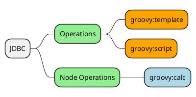

# Groovy

This document will cover the Groovy module for Ops4J.



| COMMAND         | EXAMPLE | DESCRIPTION                                 |
| --------------- | ------- | ------------------------------------------- |
| groovy:template | S       | Write stream data to groovy templates.      |
| groovy:script   |         | Rewrite the stream using groovy.            |
| groovy:calc     |         | Return the results of a groovy calculation. |

# Configuration

N/A

# Operations

## groovy:template

> Write stream data to a template and project it to other forms..

The `groovy:template` operation will combine stream data with the template to produce alternate representations of the data such as charts, reports and other visuals.

```bash
$ groovy:template -H
Usage: groovy:template [-C=<view>] [-L=<logLevel>] [-N=<name>]
                       [-t=<templatePath>]

Render a Groovy template.

  -C, --config=<view>    The configuration view for this operation.
  -L, --log=<logLevel>   The log level of this operation.
  -N, --name=<name>      The name of this operation.
  -t, --template=<templatePath>
                         The template.

Class: org.ops4j.groovy.op.GroovyTemplate
```

### Examples

#### Ex1

## groovy:script

# Node Operations

## groovy:calc
