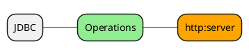

# HTTP

This document will cover the HTTP module for Ops4J.



| COMMAND     | EXAMPLE               | DESCRIPTION                                      |
| ----------- | --------------------- | ------------------------------------------------ |
| http:server | http:server -analysis | Stream data through an http:server for analysis. |

# Configuration

Below is a default configuration file which defines two database configurations; `JDBC.DB1` and `JDBC.DB2` which define Postgres and Oracle database connections.

The default JDBC connection as defined by `DEFAULT.JDBC` is `DB2`.

```json
DEFAULT {
  HTTP = "HTTP.LOCAL"
}

HTTP {
  LOCAL {
    host = "localhost"
    port = 4242
    serverRoot = "C:/ws/ws1/ops4j/src/main/resources/site"
    app = "/ops"
    deploymentName = "ops"
    deploymentPath = "/servlet"
    servlets = [
      {
        class="org.ops4j.http.servlet.AnalysisServlet"
        name= "D3 Sankey Diagram"
        path= "/analysis/d3/sankey.html"
        initParams = [{
            name = "template"
            value =  "/dexjs.gt"
          },
          {
            name = "chartType"
            value = "d3.Sankey"
          }
        ],
      },
      {
        class="org.ops4j.http.servlet.AnalysisServlet"
        name= "Chord Diagram"
        path= "/analysis/d3/chord.html"
        initParams = [{
            name = "template"
            value =  "/dexjs.gt"
          },
          {
            name = "chartType"
            value = "d3.Chord"
          }
        ]
      }
    ]
  }
 }
```

# Operations

This section covers the operations provided by the JDBC module. 

## http:server

> Start a streaming http server.
