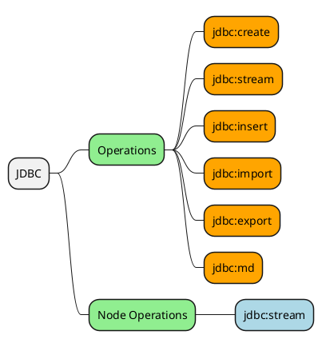

# JDBC

This document will cover the JDBC module for Ops4J.



| COMMAND     | EXAMPLE                                     | DESCRIPTION                                 |
| ----------- | ------------------------------------------- | ------------------------------------------- |
| jdbc:stream | jdbc:stream 'SELECT * FROM EMPLOYEES'       | Stream data from a JDBC source.             |
| jdbc:drop   | jdbc:drop EMPLOYEES                         | Drop a JDBC table.                          |
| jdbc:create | cat employees.json \| jdbc:create EMPLOYEES | Create JDBC tables.                         |
| jdbc:insert | cat employees.json \| jdbc:insert EMPLOYEES | Insert data into a pre-existing JDBC table. |
| jdbc:export |                                             | Export a table.                             |
| jdbc:import |                                             | Import a table.                             |

# Configuration

Below is a default configuration file which defines two database configurations; `JDBC.DB1` and `JDBC.DB2` which define Postgres and Oracle database connections.

The default JDBC connection as defined by `DEFAULT.JDBC` is `DB2`.

```json
DEFAULT {
  JDBC = "JDBC.DB2"
}

JDBC {
  DB1 {
    driver = "org.postgresql.Driver"
    url = "jdbc:postgresql://localhost:5432/ops"
    db = "ops"
    username = "ops"
    password = "decrypt(wdp20Dsdfskdj)"
  }
  DB2 {
    driver = "oracle.jdbc.OracleDriver"
    url = "jdbc:oracle:thin:@localhost:1521/OPS"
    db = "OPS"
    username = "ops"
    password = "decrypt(sfois9weuwe)"
  }
}
```

# Operations

This section covers the operations provided by the JDBC module. 

## jdbc:create

> Create a JDBC table dynamically.

The `jdbc:create` operation will create a table dynamically based upon the content of the incoming of the stream.  After assessing a configurable threshold of records, the operation will create a table with the appropriate datatypes prefering INTEGERS over DOUBLES over STRINGS.

```bash
$ jdbc:create -H
Usage: jdbc:create [-C=<view>] [--db=<db>] [--driver=<driverClass>]
                   [-L=<logLevel>] [-N=<name>] [-p=<password>]
                   [--schema=<schema>] [--threshold=<threshold>] [--url=<url>]
                   [--user=<username>] [<target>]

Stream data into a jdbc table which will be created dynamically.

      [<target>]          The table to create. 'OPS_TEMP' by default.

  -C, --config=<view>     The configuration view for this operation.
      --db=<db>           The database name.
      --driver=<driverClass>
                          The driver class.
  -L, --log=<logLevel>    The log level of this operation.
  -N, --name=<name>       The name of this operation.
  -p, --password=<password>
                          The password.
      --schema=<schema>   The db schema.
      --threshold=<threshold>
                          The commit threshold.  This represents the number of
                            records to be used in schema inference.  Default =
                            100.
      --url=<url>         The connection url.
      --user=<username>   The username.

Class: org.ops4j.jdbc.op.JdbcCreate
```

### Simple Example

In this example, we create 5 people stored in the default database `JDBC.DB2` using the default table `OPS_TEMP`.  If the table exists already, it will be dropped and replaced.

```bash
# Create a JDBC with the default name 'OPS_TEMP' containing 5 people
map -D 5 /='gen:person()' | jdbc:create

# Stream it back
jdbc:stream
```

### Named Example

```bash
# Create 5 people stored into a table named PEOPLE
map -D 5 /='gen:person()' | jdbc:create PEOPLE

# Stream them back
jdbc:stream 'SELECT * FROM PEOPLE'
```

### Moving Data

The `jdbc:stream` and `jdbc:create` operations can be combined to stream data in useful ways.

```bash
# Store the results from a query into a table called RESULTS
jdbc:stream 'SELECT * FROM PEOPLE' | jdbc:create MORE_PEOPLE

# Copy PEOPLE from DB2 (ORACLE) to DB1 (POSTGRES)
jdbc:stream -C JDBC.DB2 'SELECT * FROM PEOPLE' | \
  jdbc:create -C JDBC.DB1 PEOPLE
```

## jdbc:drop

> Drop a table.

```bash
$ jdbc:drop -H
Usage: jdbc:drop [-C=<view>] [--db=<db>] [--driver=<driverClass>]
                 [-L=<logLevel>] [-N=<name>] [-p=<password>]
                 [--schema=<schema>] [--url=<url>] [--user=<username>] [<table>]

Drop a table.

      [<table>]           The table to drop.

  -C, --config=<view>     The configuration view for this operation.
      --db=<db>           The database name.
      --driver=<driverClass>
                          The driver class.
  -L, --log=<logLevel>    The log level of this operation.
  -N, --name=<name>       The name of this operation.
  -p, --password=<password>
                          The password.
      --schema=<schema>   The db schema.
      --url=<url>         The connection url.
      --user=<username>   The username.

Class: org.ops4j.jdbc.op.JdbcDrop
```

### Simple Example

```bash
# Drop table T1 in the default database
jdbc:drop T1
# Drop table T1 from database JDBC.DB2
jdbc.drop -C JDBC.DB2 T1
```

## jdbc:stream

> Stream data from a JDBC query.

The `jdbc:stream` operation will stream data from the specified sql query.

```bash
$ jdbc:stream -H
Usage: jdbc:stream [-C=<view>] [--db=<db>] [--driver=<driverClass>]
                   [-L=<logLevel>] [-N=<name>] [-p=<password>]
                   [--schema=<schema>] [--url=<url>]
                   [--user=<username>] [<sql>]

Stream documents to and from a jdbc source.

      [<sql>]             The database sql.

  -C, --config=<view>     The configuration view for this operation.
      --db=<db>           The database name.
      --driver=<driverClass>
                          The driver class.
  -L, --log=<logLevel>    The log level of this operation.
  -N, --name=<name>       The name of this operation.
  -p, --password=<password>
                          The password.
      --schema=<schema>   The db schema.
      --url=<url>         The connection url.
      --user=<username>   The username.

Class: org.ops4j.jdbc.op.JdbcStream
```

### Simple Example

```bash
# Stream data from the default database and table.
jdbc:stream
# Stream data from table T1 in database DB1.
jdbc:stream -C JDBC.DB1 'SELECT * FROM T1'
```

## jdbc:insert

## jdbc:import

## jdbc:export
