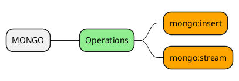

# MONGO

This document will cover the MONGO module for Ops4J.



# Configuration

```javascript
DEFAULT {
  MONGO = "MONGO.LOCAL"
}

MONGO {
  LOCAL {
    connectionString = "mongodb://localhost:27017/ops"
    db = "ops"
  }
}
```

# Operations

## mongo:insert

> Insert data into mongo.

### Examples

## mongo:stream

> Stream data from mongo.

### Examples
