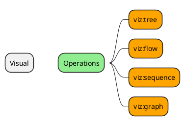

# Visual Operations

This document will cover visual operations within ops4j.  Visual operations are used to generate various types of visual information.



| COMMAND      | EXAMPLE                                                 | DESCRIPTION                                                      |
| ------------ | ------------------------------------------------------- | ---------------------------------------------------------------- |
| viz:tree     | cat data.json \| viz:tree                               | Create a tree structure representation of the streamed data.     |
| viz:flow     | cat data.json -s src -d dest  \| viz:flow               | Create a flow diagram with sequences 'src -> dest : comment'     |
| viz:sequence | cat data.json -s src -d dest -c comment \| viz:sequence | Create a sequence diagram with sequences 'src -> dest : comment' |
| viz:graph    | cat data.json \| viz:graph                              | Insert data into a pre-existing JDBC table.                      |

# Configuration

None.

# Operations

This section covers the operations provided by the JDBC module. 

## viz:flow

> Create a flow diagram.

The `viz:flow` operation will create a flow diagram from the given dataset.

```bash
$ viz:flow -H
Usage: viz:flow [-g] [-C=<view>] [-d=<destination>] [-e=<entry>]
                [-L=<logLevel>] [-N=<name>] [-o=<outputLocation>]
                [-s=<source>]

Render a transition tree of the data.

  -C, --config=<view>        The configuration view for this operation.
  -d, --dest=<destination>   The destination path.  Default = /dest
  -e, --entry=<entry>        The entry point.
  -g, --guard                Guard against circular references by terminating
                               on nodes which have already been encountered.
  -L, --log=<logLevel>       The log level of this operation.
  -N, --name=<name>          The name of this operation.
  -o, --output=<outputLocation>
                             The output location.  Default = flow.svg
  -s, --src=<source>         The source path.  Default = /src

Class: org.ops4j.visual.op.VisualFlow
```

### Examples

#### Basic Usage

```bash
echo '{"src":"a", "dst":"b"}' | viz:flow
```

Generates the following into a file called `flow.svg`.


and the following command:

```bash
$ echo '{"src":"a", "dst":"b"}{"src":"a", "dst":"c"}' | \
  viz:flow -o abc.svg
```

will generate the following into a file named `abc.svg`:


#### Energy Flow

Suppose we have a data file which contains energy mapping data of the form:

```javascript
$ head -5 energy.json
{"source":"Coal imports","target":"Coal"}
{"source":"Coal","target":"Solid"}
{"source":"Solid","target":"Industry"}
{"source":"Solid","target":"Thermal generation"}
{"source":"Solid","target":"Agriculture"}
```

The following command will generate flow information from the energy.json file.

```bash
cat energy.json | viz:flow -s /source -d /target -o energy.svg
```

Which will produce trees similar to the following:


#### Circular References

Suppose we wish to graph a flow with circular references.  In such cases, we can use the `-g` or `--guard` option to safeguard against this.

Given tree:

```bash
# Generate 50 node relationships of the form N#
# into a file named guard.svg
$ map -D 50 /src='gen:text(-pattern=N#)' \
  /dst='gen:text(-pattern=N#)' | \
  viz:flow --guard -o guard.svg
```

Generate flows which terminate when circular references are encountered.  Encode the node using a different color to indicate that it is a circular reference.


#### Entry Points

Suppose we have the following data in a file named `entry-demo.json`:

```javascript
{"src":"A1","dst":"B1"}
{"src":"A1","dst":"C1"}
{"src":"C1","dst":"D1"}
{"src":"A2","dst":"B2"}
{"src":"A2","dst":"C2"}
{"src":"C2","dst":"D2"}
```

##### Default Entry Point

When entry points are omitted, viz:flow will exhaustively ensure every potential entry point is displayed.

```bash
# Create a visual flow from entry-demo.json
$ viz:flow -D entry-demo.json

# Same thing
$ cat entry.demo.json | viz:flow

# Also works, less verbose
$ viz:flow -D entry-demo.json -O none
```

Any of the above commands will yield a `flow.svg` diagram which looks like:


##### Specific Entry Point

A specific entry point can also be specified.  The flow diagram will only depict paths which are reachable from this entry point.

```bash
# Create a visual flow from entry-demo.json
$ viz:flow -D entry-demo.json --entry A2 -o a2.svg
```

Which will yield a `a2.svg` diagram which looks like:


we can even refer to an enty point downstream in the flow.

```bash
# Create a visual flow from entry-demo.json
$ viz:flow -D entry-demo.json --entry C2 -o c2.svg
```


## viz:graph

> Create a graph.

## viz:sequence

> Create a sequence diagram.

## viz:tree

> Create a tree.
